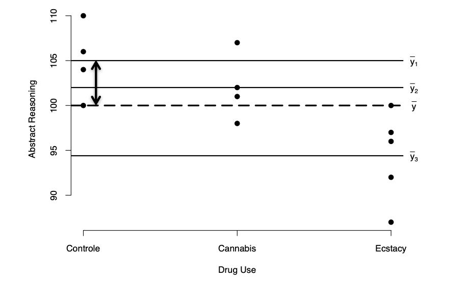

```{r, echo = FALSE, results = "hide"}
include_supplement("vufgb-sumofsquares-001-en-graph-01.png", recursive = TRUE)
```
Question
========
  
In the figure below a deviation is indicated with a double-headed arrow. Describe this deviation to yourself in words. To which sum of squares does this deviation belong?

 
  
Answerlist
----------
* Between-groups sum of squares (SSbetween).
* Within groups sum of squares (SSwithin).
* Residual sum of squares (SSresidual).
* Total sum of squares (SStotal).

Solution
========

Answerlist
----------
* Correct
* Incorrect
* Incorrect
* Incorrect

Meta-information
================
exname: vufgb-sumofsquares-001-en
extype: schoice
exsolution: 1000
exsection: Inferential Statistics/Regression/Sum of squares
exextra[Type]: Conceptual, Interpreting graph
exextra[Language]: English
exextra[Level]: Statistical Reasoning
