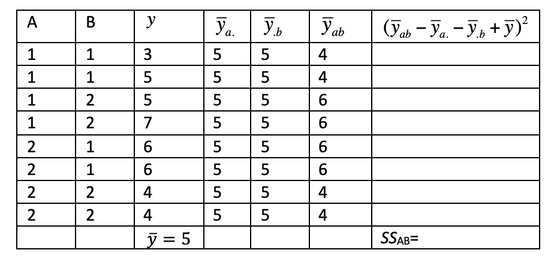

```{r, echo = FALSE, results = "hide"}
include_supplement("vufgb-sumofsquares-002-en-graph-01.png", recursive = TRUE)
```
Question
========
  
Below you find an ANOVA table for a 2x2 factorial design. Compute the sum of squares of the interaction between factors A and B ($SS_{AB}$).

 
  
Answerlist
----------
* 8.
* 4.
* 2.
* 1.

Solution
========

Answerlist
----------
* Correct
* Incorrect
* Incorrect
* Incorrect

Meta-information
================
exname: vufgb-sumofsquares-002-en
extype: schoice
exsolution: 1000
exsection: Inferential Statistics/Regression/Sum of squares
exextra[Type]: Calculation
exextra[Language]: English
exextra[Level]: Statistical Thinking
