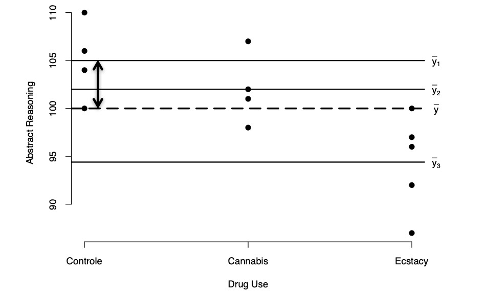

```{r, echo = FALSE, results = "hide"}
include_supplement("vufgb-sumofsquares-002-nl-graph-01.png", recursive = TRUE)
```
Question
========
  
In onderstaande figuur staat met een dubbelpuntige pijl een deviatie aangeven. Omschrijf deze deviatie voor jezelf in woorden. Bij welke kwadratensom hoort deze deviatie?

 
  
Answerlist
----------
* Tussengroeps kwadratensom (SSbetween).
* Binnengroeps kwadratensom (SSwithin).
* Residuele kwadratensom (SSresidual).
* Totale kwadratensom (SStotal).

Solution
========

Answerlist
----------
* Correct
* Incorrect
* Incorrect
* Incorrect

Meta-information
================
exname: vufgb-sumofsquares-002-nl
extype: schoice
exsolution: 1000
exsection: Inferential Statistics/Regression/Sum of squares
exextra[Type]: Conceptual, Interpretating graph
exextra[Language]: Dutch
exextra[Level]: Statistical Reasoning