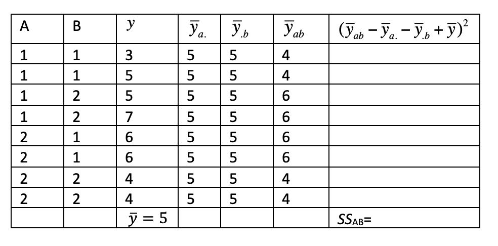

```{r, echo = FALSE, results = "hide"}
include_supplement("vufgb-sumofsquares-003-nl-graph-01.png", recursive = TRUE)
```
Question
========
  
Gegeven is onderstaande ANOVA tabel, horende bij een 2x2 factorieel design. Bereken de kwadratensom van de interactie tussen factoren A en B ($SS_{AB}$).

 
  
Answerlist
----------
* 8.
* 4.
* 2.
* 1.

Solution
========

Answerlist
----------
* Correct
* Incorrect
* Incorrect
* Incorrect

Meta-information
================
exname: vufgb-sumofsquares-003-nl
extype: schoice
exsolution: 1000
exsection: Inferential Statistics/Regression/Sum of squares
exextra[Type]: Calculation
exextra[Language]: Dutch
exextra[Level]: Statistical Thinking
