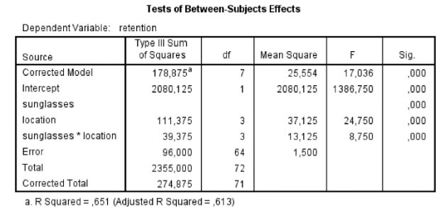

```{r, echo = FALSE, results = "hide"}
include_supplement("vufgb-sumofsquares-004-en-table01.jpg", recursive = TRUE)
```

Question
========

Consider the following (incomplete) SPSS output of an orthogonal factorial ANOVA:


  
What is the size of the Sum of Squares assigned to the main effect of sunglasses? 
  
Answerlist
----------
* 28.125
* 18.750
* 72.000
* 56.625

Solution
========

Answerlist
----------
* Correct
* Incorrect
* Incorrect
* Incorrect

Meta-information
================
exname: vufgb-sumofsquares-004-en
extype: schoice
exsolution: 1000
exsection: Inferential Statistics/Regression/Sum of squares, Inferential Statistics/Parametric Techniques/ANOVA
exextra[ID]: aecb9
exextra[Type]: Interpreting output
exextra[Program]: SPSS
exextra[Language]: English
exextra[Level]: Statistical Literacy
