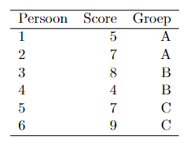

```{r, echo = FALSE, results = "hide"}
include_supplement("vufgb-sumofsquares-005-nl-table01.jpg", recursive = TRUE)
```

Question
========
  
The table below covers the results of 6 subjects who were divided into three research groups A, B, and C via randomization. It can be seen from the table that the averages in groups A, B, and C, respectively, are 6, 6, and 8.



The square sum (SS) of the Research Group factor falls in the interval:

Answerlist
----------
* 〈0, 3]
* 〈3, 6]
* 〈6, 9]
* 〈9, 12]

Solution
========

Answerlist
----------
* Incorrect
* Incorrect
* Correct
* Incorrect

Meta-information
================
exname: vufgb-sumofsquares-005-en
extype: schoice
exsolution: 0010
exsection: Inferential Statistics/Regression/Sum of squares, Descriptive statistics/Data representation/Tables
exextra[Type]: Calculation, Interpreting output
exextra[Program]: 
exextra[Language]: English
exextra[Level]: Statistical Thinking
