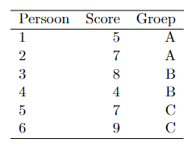

```{r, echo = FALSE, results = "hide"}
include_supplement("vufgb-sumofsquares-005-nl-table01.jpg", recursive = TRUE)
```

Question
========
  
De onderstaande tabel betreft de resultaten van 6
personen die via randomisatie over drie onderzoeksgroepen A, B en C zijn verdeeld. Uit de tabel is af te leiden dat de gemiddelden in de groepen A, B, en C, repectievelijk, 6, 6 en 8 zijn.



De kwadratensom (SS) van de factor ‘Onderzoeksgroep’ valt in het interval:  

Answerlist
----------
* 〈0, 3]
* 〈3, 6]
* 〈6, 9]
* 〈9, 12]

Solution
========

Answerlist
----------
* Incorrect
* Incorrect
* Correct
* Incorrect

Meta-information
================
exname: vufgb-sumofsquares-005-nl
extype: schoice
exsolution: 0010
exsection: Inferential Statistics/Regression/Sum of squares, Descriptive statistics/Data representation/Tables
exextra[Type]: Calculation, Interpreting output
exextra[Program]: 
exextra[Language]: Dutch
exextra[Level]: Statistical Thinking