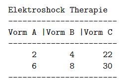

```{r, echo = FALSE, results = "hide"}
include_supplement("vufgb-sumofsquares-006-nl-table01.jpg", recursive = TRUE)
```

Question
========

An experiment tests three new forms of Electroshock Therapy in six patients. The response variable is quality of life after treatment. The table below shows the quality of life scores of the six patients


  
Calculate the Within-groups SS.  
  
Answerlist
----------
* 16
* 24
* 48
* 64

Solution
========

Answerlist
----------
* Incorrect
* Incorrect
* Correct
* Incorrect

Meta-information
================
exname: vufgb-sumofsquares-006-en
extype: schoice
exsolution: 0010
exsection: Inferential Statistics/Regression/Sum of squares, Descriptive statistics/Data representation/Tables
exextra[Type]: Calculation
exextra[Program]: 
exextra[Language]: English
exextra[Level]: Statistical Thinking
