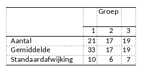

```{r, echo = FALSE, results = "hide"}
include_supplement("vufgb-sumofsquares-009-nl-table01.jpg", recursive = TRUE)
```

Question
========

Three groups are compared on the mean test score. A total of 57 individuals participate. The table below shows the mean on the test, number of observations and standard deviation for each condition. What is the square sum (SS) of the residuals (error) of the ANOVA model used to test whether the averages in the three conditions differ from each other?



  
Answerlist
----------
* 5187
* 3458
* 64.04
* 42.69


Solution
========

Answerlist
----------
* Incorrect
* Correct
* Incorrect
* Incorrect

Meta-information
================
exname: vufgb-sumofsquares-009-en
extype: schoice
exsolution: 0100
exsection: Inferential Statistics/Regression/Sum of squares, Descriptive statistics/Data representation/Tables
exextra[ID]: 6b770
exextra[Type]: Interpreting output, Calculation
exextra[Program]: 
exextra[Language]: English
exextra[Level]: Statistical Literacy
