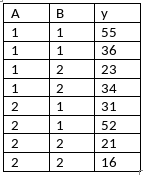

```{r, echo = FALSE, results = "hide"}
include_supplement("vufgb-sumofsquares-010-nl-table01.jpg", recursive = TRUE)
```

Question
========

Given are the following scores for an ANOVA with two Factors ('Two-Way ANOVA'). Calculate the sum of squares ('sum of squares') for factor A (SSA).


  
Answerlist
----------
* 18
* 98
* 474
* 800


Solution
========

Answerlist
----------
* Incorrect
* Correct
* Incorrect
* Incorrect

Meta-information
================
exname: vufgb-sumofsquares-010-en
extype: schoice
exsolution: 0100
exsection: Inferential Statistics/Regression/Sum of squares, Inferential Statistics/Parametric Techniques/ANOVA/Twoway ANOVA, Descriptive statistics/Data representation/Tables
exextra[ID]: 9ba2b
exextra[Type]: Calculation, Interpreting output
exextra[Program]: 
exextra[Language]: English
exextra[Level]: Statistical Literacy
