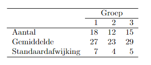

```{r, echo = FALSE, results = "hide"}
include_supplement("vufgb-sumofsquares-011-nl-table01.jpg", recursive = TRUE)
```

Question
========

Three experimental conditions are compared on the mean test score. A total of 45 individuals participate. The table below shows the mean on the test, number of observations and standard deviation for each condition.


  
What is the square sum (SS) of the residuals (error) of the ANOVA model used to test whether the averages in the three conditions differ from each other?  
  
Answerlist
----------
* 1359
* 3236
* 2038
* 2157

Solution
========

Answerlist
----------
* Correct
* Incorrect
* Incorrect
* Incorrect

Meta-information
================
exname: vufgb-sumofsquares-011-en
extype: schoice
exsolution: 1000
exsection: Inferential Statistics/Regression/Sum of squares, Inferential Statistics/Regression/Residuals, Inferential Statistics/Parametric Techniques/ANOVA
exextra[ID]: 0bcda
exextra[Type]: Interpreting output, Calculation
exextra[Program]: 
exextra[Language]: English
exextra[Level]: Statistical Thinking
