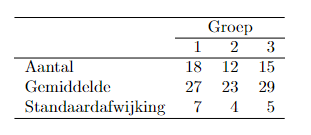

```{r, echo = FALSE, results = "hide"}
include_supplement("vufgb-sumofsquares-011-nl-table01.jpg", recursive = TRUE)
```

Question
========

Drie experimentele condities worden vergeleken op de gemiddelde testscore. In totaal doen 45 personen mee. In onderstaande tabel staat voor elke conditie het gemiddelde op de test, het aantal observaties en de standaardafwijking vermeld.


  
Hoe groot is de kwadratensom (SS) van de residuen (error) van het ANOVA model dat wordt gebruikt om te toetsen of de gemiddelden in de drie condities van elkaar verschillen?  
  
Answerlist
----------
* 1359
* 3236
* 2038
* 2157

Solution
========

Answerlist
----------
* Correct
* Incorrect
* Incorrect
* Incorrect

Meta-information
================
exname: vufgb-sumofsquares-011-nl
extype: schoice
exsolution: 1000
exsection: Inferential Statistics/Regression/Sum of squares, Inferential Statistics/Regression/Residuals, Inferential Statistics/Parametric Techniques/ANOVA
exextra[Type]: Interpretating output, Calculation
exextra[Program]: 
exextra[Language]: Dutch
exextra[Level]: Statistical Thinking