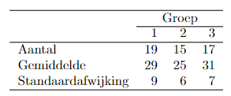

```{r, echo = FALSE, results = "hide"}
include_supplement("vufgb-sumofsquares-012-nl-table01.jpg", recursive = TRUE)
```

Question
========

In a survey, a questionnaire is administered at different times of the year. Group 1 takes the test in January, Group 2 in May and Group 3 in September. A total of 51 people participate. The table below shows the mean on the test, number of observations and standard deviation for each group.


  
What is the squared sum (SS) of the residuals (error) of the ANOVA model used to test whether the averages of the three months differ from each other?  
  
Answerlist
----------
* 57.21
* 2746
* 4119
* 38.14

Solution
========

Answerlist
----------
* Incorrect
* Correct
* Incorrect
* Incorrect

Meta-information
================
exname: vufgb-sumofsquares-012-en
extype: schoice
exsolution: 0100
exsection: Inferential Statistics/Regression/Sum of squares, Inferential Statistics/Regression/Residuals, Inferential Statistics/Parametric Techniques/ANOVA
exextra[ID]: bedd8
exextra[Type]: Interpreting output, Calculation
exextra[Program]: 
exextra[Language]: English
exextra[Level]: Statistical Thinking
