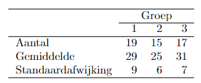

```{r, echo = FALSE, results = "hide"}
include_supplement("vufgb-sumofsquares-012-nl-table01.jpg", recursive = TRUE)
```

Question
========

In een onderzoek wordt een vragenlijst op verschillende periodes van het jaar afgenomen. Groep 1 maakt de test in Januari, Groep 2 in Mei en Groep 3 in September. In het totaal doen 51 personen mee. In onderstaande tabel staat voor elke groep het gemiddelde op de test, het aantal observaties en de standaardafwijking vermeld.


  
Hoe groot is de kwadratensom (SS) van de residuen (error) van het ANOVA model dat wordt gebruikt om te toetsen of de gemiddelden van de drie maanden van elkaar verschillen?  
  
Answerlist
----------
* 57.21
* 2746
* 4119
* 38.14

Solution
========

Answerlist
----------
* Incorrect
* Correct
* Incorrect
* Incorrect

Meta-information
================
exname: vufgb-sumofsquares-012-nl
extype: schoice
exsolution: 0100
exsection: Inferential Statistics/Regression/Sum of squares, Inferential Statistics/Regression/Residuals, Inferential Statistics/Parametric Techniques/ANOVA
exextra[Type]: Interpreting output, Calculation
exextra[Program]: 
exextra[Language]: Dutch
exextra[Level]: Statistical Thinking
