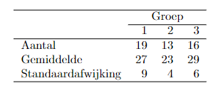

```{r, echo = FALSE, results = "hide"}
include_supplement("vufgb-sumofsquares-015-nl-table01.jpg", recursive = TRUE)
```

Question
========

Three experimental conditions are compared on the mean test score. A total of 48 individuals participate. The table below shows the mean on the test, number of observations and standard deviation for each condition.


  
What is the square sum (SS) of the residuals (error) of the ANOVA model used to test whether the averages in the three conditions differ from each other?  
  
Answerlist
----------
* 48.67
* 2190
* 3285
* 32.45

Solution
========

Answerlist
----------
* Incorrect
* Correct
* Incorrect
* Incorrect

Meta-information
================
exname: vufgb-sumofsquares-015-en
extype: schoice
exsolution: 0100
exsection: Inferential Statistics/Regression/Sum of squares, Inferential Statistics/Regression/Residuals, Inferential Statistics/Parametric Techniques/ANOVA, Descriptive statistics/Summary Statistics/Measures of Location/Mean
exextra[ID]: 493be
exextra[Type]: Interpreting output, Calculation
exextra[Program]: 
exextra[Language]: English
exextra[Level]: Statistical Thinking
