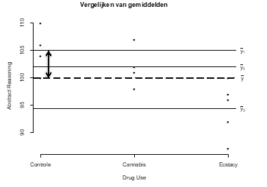

```{r, echo = FALSE, results = "hide"}
include_supplement("vufgb-sumofsquares-017-nl-graph01.jpg", recursive = TRUE)
```

Question
========

In the figure below, a double-pointed vertical arrow indicates a deviation. Describe this deviation for yourself in words. To which quadrat sum does this deviation belong?


  
Answerlist
----------
* Intermediate-group quadratic sum ($SS_{within}$)
* Inner group squared sum ( $SS_{between}$)
* Inner group squared sum ($SS_{within}$)
* Intermediate quadratic sum ($SS_{between}$)


Solution
========

Answerlist
----------
* Incorrect
* Incorrect
* Incorrect
* Correct

Meta-information
================
exname: vufgb-sumofsquares-017-en
extype: schoice
exsolution: 0001
exsection: Inferential Statistics/Regression/Sum of squares
exextra[Type]: Interpreting graph, Conceptual
exextra[Program]: 
exextra[Language]: English
exextra[Level]: Statistical Thinking
