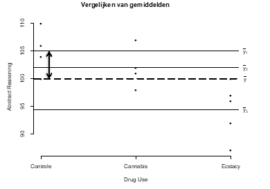

```{r, echo = FALSE, results = "hide"}
include_supplement("vufgb-sumofsquares-017-nl-graph01.jpg", recursive = TRUE)
```

Question
========

In onderstaande figuur staat met een dubbelpuntige verticale pijl een deviatie aangeven. Omschrijf deze deviatie voor jezelf in woorden. Bij welke kwadratensom hoort deze deviatie?


  
Answerlist
----------
* Tussengroeps kwadratensom ($SS_{within}$)
* Binnengroeps kwadratensom ($SS_{between}$)
* Binnengroeps kwadratensom ($SS_{within}$)
* Tussengroeps kwadratensom ($SS_{between}$)


Solution
========

Answerlist
----------
* Incorrect
* Incorrect
* Incorrect
* Correct

Meta-information
================
exname: vufgb-sumofsquares-017-nl
extype: schoice
exsolution: 0001
exsection: Inferential Statistics/Regression/Sum of squares
exextra[Type]: Interpreting graph, Conceptual
exextra[Program]: 
exextra[Language]: Dutch
exextra[Level]: Statistical Thinking
