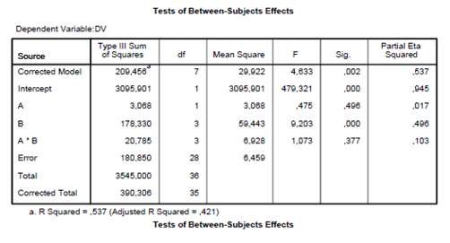

```{r, echo = FALSE, results = "hide"}
include_supplement("vufgb-sumofsquares-018-nl-table01.jpg", recursive = TRUE)
```

Question
========

Consider the following output generated with SPSS. 



What is the Sum of Squares of the correlation between factors A, B and AxB with Y that is not unique (i.e. shared)? 
Answerlist
----------
* 20.785
* 7.273
* 0.115
* 0.103

Solution
========

Answerlist
----------
* Incorrect
* Correct
* Incorrect
* Incorrect

Meta-information
================
exname: vufgb-sumofsquares-018-en
extype: schoice
exsolution: 0100
exsection: Inferential Statistics/Regression/Sum of squares
exextra[ID]: 0ab5d
exextra[Type]: Interpreting output
exextra[Program]: SPSS
exextra[Language]: English
exextra[Level]: Statistical Literacy
