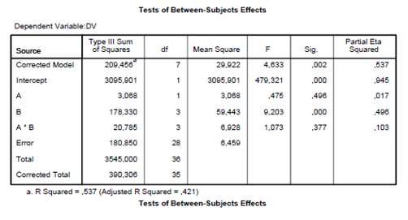

```{r, echo = FALSE, results = "hide"}
include_supplement("vufgb-sumofsquares-018-nl-table01.jpg", recursive = TRUE)
```

Question
========

Beschouw de volgende output die gegenereerd is met SPSS. 



Hoe groot is de Sum of Squares van de samenhang tussen factoren A, B en AxB met Y die niet uniek is (i.e. gedeeld wordt)? 
  
Answerlist
----------
* 20.785 
* 7.273
* 0.115
* 0.103

Solution
========

Answerlist
----------
* Incorrect
* Correct
* Incorrect
* Incorrect

Meta-information
================
exname: vufgb-sumofsquares-018-nl
extype: schoice
exsolution: 0100
exsection: Inferential Statistics/Regression/Sum of squares
exextra[ID]: ecf3b
exextra[Type]: Interpreting output
exextra[Program]: SPSS
exextra[Language]: Dutch
exextra[Level]: Statistical Literacy
