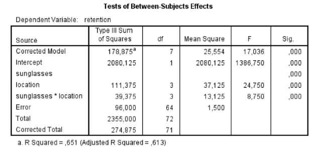

```{r, echo = FALSE, results = "hide"}
include_supplement("vufgb-sumofsquares-019-nl-table01.jpg", recursive = TRUE)
```

Question
========

Consider the below (incomplete) SPSS output of an orthogonal factorial ANOVA:


  
What is the square sum (*Sum of Squares*) assigned to the main effect (*main effect*) for *sunglasses*? 
Answerlist
----------
* 28.125
* 18.750
* 72.000
* 56.625

Solution
========

Answerlist
----------
* Correct
* Incorrect
* Incorrect
* Incorrect

Meta-information
================
exname: vufgb-sumofsquares-019-en
extype: schoice
exsolution: 1000
exsection: Inferential Statistics/Regression/Sum of squares, Inferential Statistics/Parametric Techniques/ANOVA
exextra[ID]: 7854c
exextra[Type]: Interpreting output
exextra[Program]: SPSS
exextra[Language]: English
exextra[Level]: Statistical Literacy
