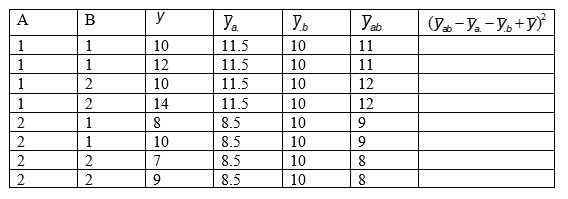

```{r, echo = FALSE, results = "hide"}
include_supplement("vufgb-sumofsquares-020-nl-table01.jpg", recursive = TRUE)
```

Question
========

Given is the ANOVA table below, belonging to a 2x2 factorial design.

Calculate the square of the interaction between factors *A* and *B* ($SS_{AB}$).


  
Answerlist
----------
* 0
* 10
* 2
* 40

Solution
========

First, calculate the average of *y* yourself: $\frac{(10+12+10+14+8+10+7+9)}{8} = \frac{80}{8} = 10$.

Then fill in the last column for each subject. For example, for subject 1: $(11-11.5-10+10)^{2} = -0.5^{2} = 0.25$.

If you do this for all subjects you get (coincidentally) 0.25 as the value for each person. The sum of this is $0.25 \times 8 = 2$.

Answerlist
----------
* Incorrect
* Incorrect
* Correct
* Incorrect

Meta-information
================
exname: vufgb-sumofsquares-020-en
extype: schoice
exsolution: 0010
exsection: Inferential Statistics/Regression/Sum of squares, Inferential Statistics/Parametric Techniques/ANOVA
exextra[ID]: 09132
exextra[Type]: Calculation, Interpreting output
exextra[Program]: 
exextra[Language]: English
exextra[Level]: Statistical Literacy
