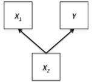

```{r, echo = FALSE, results = "hide"}
include_supplement("vufgb-suppression-006-nl-figure01.jpg", recursive = TRUE)
```

Question
========

Given is the path diagram below. Which multivariate relationship is depicted here?



  
Answerlist
----------
* Partial confounding
* Full confounding
* Partial mediation
* Full mediation

Solution
========

Answerlist
----------
* Incorrect
* Correct
* Incorrect
* Incorrect

Meta-information
================
exname: vufgb-suppression-006-en
extype: schoice
exsolution: 0100
exsection: Inferential Statistics/Regression/Multiple linear regression/Suppression, Inferential Statistics/Regression/Multiple linear regression/Mediation
exextra[ID]: 633b1
exextra[Type]: Interpreting graph
exextra[Program]: 
exextra[Language]: English
exextra[Level]: Statistical Literacy
