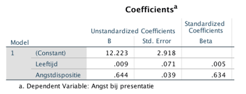

```{r, echo = FALSE, results = "hide"}
include_supplement("vufgb-tstatistic-004-nl-table01.jpg", recursive = TRUE)
```

Question
========

The SPSS table below shows the results of a multiple regression analysis with no interaction. Perform a *t* test to determine if there is an association between Anxiety Disposition and Anxiety at Presentation, statistically controlled for Age (*N* = 412).


  
Answerlist
----------
* *t*=16.51 > 1.96, so there is a correlation.
* 1.96 < *t*=16.51, so there is no correlation.
* *t*=16.26 > 1.96, so there is a correlation.
* 1.96 < *t*=16.26, so there is no relationship.


Solution
========

Answerlist
----------
* Correct
* Incorrect
* Incorrect
* Incorrect

Meta-information
================
exname: vufgb-tstatistic-004-en
extype: schoice
exsolution: 1000
exsection: Inferential Statistics/NHST/Test statistic/t-statistic
exextra[Type]: Performing analysis
exextra[Program]: SPSS
exextra[Language]: English
exextra[Level]: Statistical Thinking
