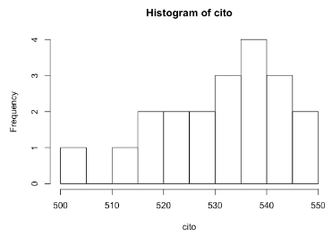

```{r, echo = FALSE, results = "hide"}
include_supplement("vufgb-tstatistic-007-nl-histogram01.jpg", recursive = TRUE)
```

Question
========

See the histogram below, TRUE showing the frequency distribution of the CITO scores of 20 grade eight students. The mean in this sample is 531, with a standard deviation of 12.92. The national average is 535. 


  
Calculate the *t* value of the test that tests whether the sample mean deviates significantly from the national mean. 
Answerlist
----------
* -0.31
* -1.38
* -4.00
* -6.19

Solution
========

Answerlist
----------
* Incorrect
* Correct
* Incorrect
* Incorrect

Meta-information
================
exname: vufgb-tstatistic-007-en
extype: schoice
exsolution: 0100
exsection: Inferential Statistics/NHST/Test statistic/t-statistic, Descriptive statistics/Data representation/Graphs/Histogram
exextra[Type]: Calculation, Interpreting graph
exextra[Program]: 
exextra[Language]: English
exextra[Level]: Statistical Literacy
