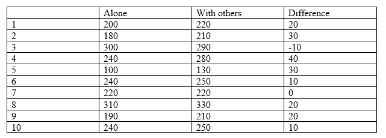

```{r, echo = FALSE, results = "hide"}
include_supplement("vufgb-ttest-002-en-table01.jpg", recursive = TRUE)
```

Question
========

In a study the reaction time of 10 students on a cognitive task is measured during two conditions: while they are alone, and while they are with others. The table below shows the reaction times in milliseconds in the two conditions and the difference in response times between the two conditions.

What is the *t*-value of the test for the equality of the two means in the two conditions?

*Advice: use the ‘paired-difference *t*-test’.*



  
Answerlist
----------
* 1.14
* 1.20
* 3.60
* 11.38

Solution
========

$t = \frac{(mean \; of \; the \; difference \; scores – 0)}{se}$ 

So firstly, you have to calculate the mean of the difference scores and the standard error. 

The mean of the difference scores: $(20+30-10+40+30+10+0+20+20+10) \div 10 = 170 \div 10 = 17$

Standard deviation of the difference scores: $\sqrt{\frac{(20-17)^{2}+(30-17)^{2}+(-10-17)^2+(40-17)^2+(30-17)^2+(10-17)^2+(0-17)^2+(20-17)^2+(20-17)^2+(10-17)^2}{(10-1)}} = \sqrt{\frac{2010}{9}} = 14.94$

$se = \frac{s}{\sqrt {n}} = \frac{14.94}{\sqrt {10}} = 4.73$

Filling it in gives: $\frac{17 – 0}{4.73} = 3.60$

*Advice: do you want to minimize the chance of a calculation error? Make a table to calculate the standard deviation of the difference scores by adding a column with the deviations and a column with the squared deviations.*

Answerlist
----------
* Incorrect
* Incorrect
* Correct
* Incorrect

Meta-information
================
exname: vufgb-ttest-002-en
extype: schoice
exsolution: 0010
exsection: Inferential Statistics/Parametric Techniques/t-test
exextra[Type]: Interpreting output, Calculation
exextra[Program]: 
exextra[Language]: English
exextra[Level]: Statistical Thinking
