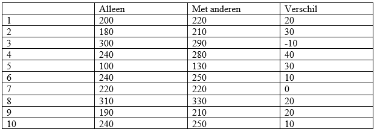

```{r, echo = FALSE, results = "hide"}
include_supplement("vufgb-ttest-003-nl-table01.jpg", recursive = TRUE)
```

Question
========

In a study, 10 students' reaction times to a cognitive task are measured during two conditions: while alone, and while with others. The table below shows the reaction times in milliseconds in the two conditions, and the difference in reaction times between the two conditions.

What is the found *t* value of the test for the equality of the two averages in the two conditions?

Tip: use the paired-difference *t* test.


  
Answerlist
----------
* 1.14
* 1.20
* 3.60
* 11.38

Solution
========

$t = \frac{(gemiddelde \; van \; verschilscores–0)}{se}$

So you must first calculate the mean of the difference scores and the standard error.

Mean of difference scores: $\frac{(20+30-10+40+30+10+0+20+20+10)}{10} = \frac{170}{10} = 17$

Standard deviation of difference scores:
$\sqrt{\frac{(20-17)^{2}+(30-17)^{2}+(-10-17)^2+(40-17)^2+(30-17)^2+(10-17)^2+(0-17)^2+(20-17)^2+(20-17)^2+(10-17)^2}{(10-1)}} = \sqrt{\frac{2010}{9}} = 14.94$

$se = \frac{s}{\sqrt{n}} = \frac{14.94}{\sqrt{10}} = 4.73$

Filling in gives: $\frac{(17–0)}{4.73} = 3.60$

Tip: Reduce chances of a calculation error? Then create a calculation table for calculating the standard deviation of difference scores by adding a column of unsquared deviations and a column of squared deviations to the table.

Answerlist
----------
* Incorrect
* Incorrect
* Correct
* Incorrect

Meta-information
================
exname: vufgb-ttest-003-en
extype: schoice
exsolution: 0010
exsection: Inferential Statistics/Parametric Techniques/t-test
exextra[Type]: Interpreting output, Calculation
exextra[Program]: 
exextra[Language]: English
exextra[Level]: Statistical Thinking
