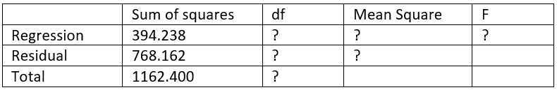

```{r, echo = FALSE, results = "hide"}
include_supplement("vufgb-twowayanova-001-nl.png", recursive = TRUE)
```

Question
========
Gegeven is onderstaande incomplete ANOVA tabel. De tabel hoort bij een meervoudig regressiemodel. In dit model zijn twee predictoren zonder interactie. De studie werd uitgevoerd met een steekproef van 40 personen. Bereken de *F*-waarde.



Answerlist
----------
* 6.43
* 6.60
* 9.49
* 9.75

Meta-information
================
exname: vufgb-twowayanova-001-nl
extype: schoice
exsolution: 0100
exsection: Inferential Statistics/Parametric Techniques/ANOVA/Twoway ANOVA, Inferential Statistics/Parametric Techniques/ANOVA/ANOVA F-test
exextra[ID]: 46f9c
exextra[Type]: Calculation, Case, Interpreting output
exextra[Language]: Dutch
exextra[Level]: Statistical Thinking
