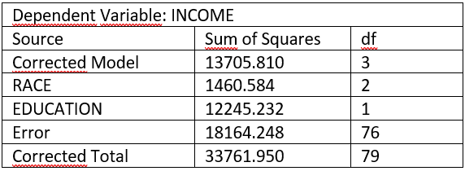

```{r, echo = FALSE, results = "hide"}
include_supplement("vufgb-twowayanova-002-nl.png", recursive = TRUE)
```

Question
========
We voerden een tweewegs variantieanalyse (*two-way ANOVA*) uit zonder interactie. Hieronder zie je de incomplete ANOVA-tabel daarvan. Bereken de partiele $\eta^2$ voor RACE en beschrijf de effectsterkte. 



Answerlist
----------
* 0.04. Dit is een *klein tot middelmatig* effect.
* 0.07. Dit is een *middelmatig tot groot* effect.
* 0.07. Dit is een *klein tot middelmatig* effect.
* 0.04. Dit is een *middelmatig tot groot* effect.

Meta-information
================
exname: vufgb-twowayanova-002-nl
extype: schoice
exsolution: 0100
exsection: Inferential Statistics/Parametric Techniques/ANOVA/Twoway ANOVA
exextra[Type]: Calculation, Case, Interpreting output
exextra[Language]: Dutch
exextra[Level]: Statistical Thinking
