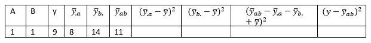

```{r, echo = FALSE, results = "hide"}
include_supplement("vufgb-twowayanova-012-nl-table01.jpg", recursive = TRUE)
```

Question
========
For a two-way ANOVA, the squared sums are calculated using a calculation scheme, shown below for 1 subject. The overall mean $\overline{y}$ is 12. Calculate the squared deviation of this subject associated with the squared sum of Factor B ($SS_{B}$).



  
Answerlist
----------
* -2
* 2
* 4
* 5

Solution
========

Answerlist
----------
* Incorrect
* Incorrect
* Correct
* Incorrect

Meta-information
================
exname: vufgb-twowayanova-012-en
extype: schoice
exsolution: 0010
exsection: Inferential Statistics/Parametric Techniques/ANOVA/Twoway ANOVA, Inferential Statistics/Regression/Sum of squares
exextra[Type]: Calculation
exextra[Program]: 
exextra[Language]: English
exextra[Level]: Statistical Literacy
