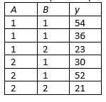

```{r, echo = FALSE, results = "hide"}
include_supplement("vufgb-twowayanova-013-nl-table01.jpg", recursive = TRUE)
```

Question
========

Given are the following scores for an ANOVA with two Factors ("Two-Way ANOVA").

Calculate the mean square sum ('mean square') for factor B (*MSB*).


  
Answerlist
----------
* 245
* 294
* 490
* 588

Solution
========

Answerlist
----------
* Incorrect
* Incorrect
* Incorrect
* Correct

Meta-information
================
exname: vufgb-twowayanova-013-en
extype: schoice
exsolution: 0001
exsection: Inferential Statistics/Parametric Techniques/ANOVA/Twoway ANOVA
exextra[Type]: Calculation
exextra[Program]: 
exextra[Language]: English
exextra[Level]: Statistical Literacy
