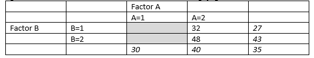

```{r, echo = FALSE, results = "hide"}
include_supplement("vufgb-twowayanova-014-nl-table01.jpg", recursive = TRUE)
```

Question
========

The table below shows the averages associated with a two-way ANOVA. There are the same number of subjects in each cell. If there is no interaction between factors A and B, what averages should be in the two cells highlighted in gray?


  
Answerlist
----------
* 15 and 15
* 22 and 38
* 5 and 5
* 32 and 48


Solution
========

Answerlist
----------
* Incorrect
* Correct
* Incorrect
* Incorrect

Meta-information
================
exname: vufgb-twowayanova-014-en
extype: schoice
exsolution: 0100
exsection: Inferential Statistics/Parametric Techniques/ANOVA/Twoway ANOVA, Probability/Elementary Probability/Random variables/Expected value
exextra[Type]: Calculation, Interpreting output
exextra[Program]: 
exextra[Language]: English
exextra[Level]: Statistical Literacy
