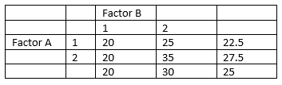

```{r, echo = FALSE, results = "hide"}
include_supplement("vufgb-twowayanova-016-nl-table01.jpg", recursive = TRUE)
```

Question
========

The table below shows the averages for an outcome variable for a two-factor ANOVA. Review the pattern of averages and draw a conclusion.


  
Answerlist
----------
* There is only a main effect of factor A.
* There is only main effect of factor B.
* There is only main effect of factors A and B.
* There is an interaction effect between factors A and B.

Solution
========

Answerlist
----------
* Incorrect
* Incorrect
* Incorrect
* Correct

Meta-information
================
exname: vufgb-twowayanova-016-en
extype: schoice
exsolution: 0001
exsection: Inferential Statistics/Parametric Techniques/ANOVA/Twoway ANOVA
exextra[ID]: 4b980
exextra[Type]: Interpreting output
exextra[Program]: 
exextra[Language]: English
exextra[Level]: Statistical Thinking
