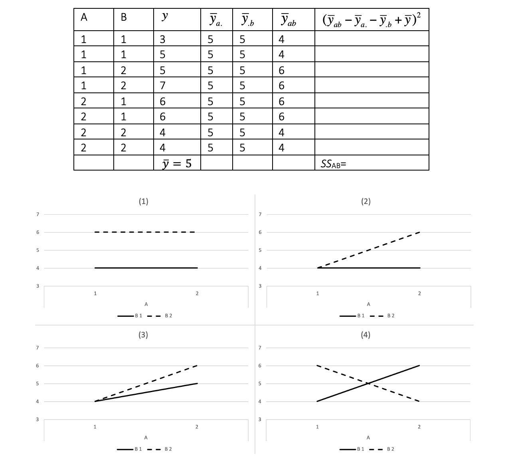

```{r, echo = FALSE, results = "hide"}
include_supplement("vufgb-twowayanova-022-nl-graph-01.png", recursive = TRUE)
```
Question
========
  
Given is the ANOVA table below, belonging to a 2x2 factorial design. Which figure belongs to the pattern of group averages in the table?

 
  
Answerlist
----------
* Figure (1)
* Figure (2)
* Figure (3)
* Figure (4)

Solution
========

Answerlist
----------
* Incorrect
* Incorrect
* Incorrect
* Correct

Meta-information
================
exname: vufgb-twowayanova-022-en
extype: schoice
exsolution: 0001
exsection: Descriptive statistics/Summary Statistics/Measures of Location/Mean, Inferential Statistics/Parametric Techniques/ANOVA/Twoway ANOVA
exextra[Type]: Conceptual, Interpreting graph
exextra[Language]: English
exextra[Level]: Statistical Reasoning
