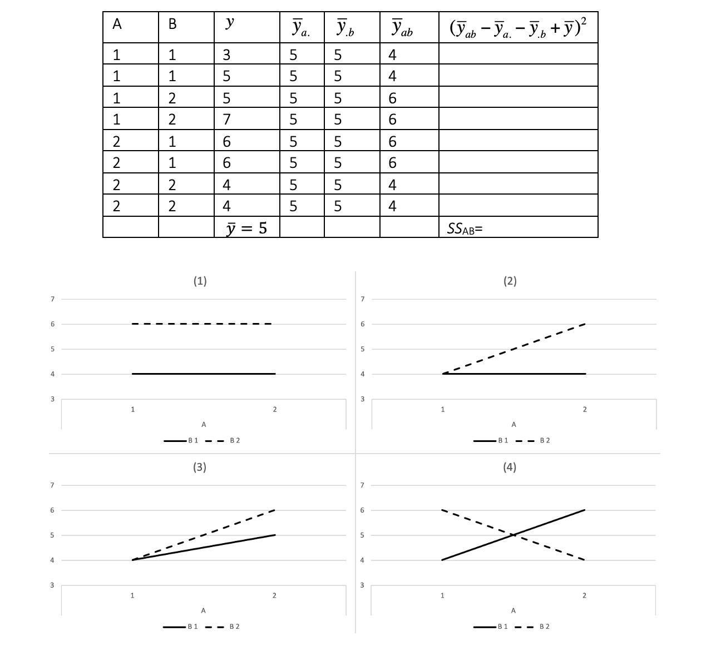

```{r, echo = FALSE, results = "hide"}
include_supplement("vufgb-twowayanova-022-nl-graph-01.png", recursive = TRUE)
```
Question
========
  
Gegeven is onderstaande ANOVA tabel, horende bij een 2x2 factorieel design. Welke figuur hoort bij het patroon van de groepsgemiddeldes in de tabel?

 
  
Answerlist
----------
* Figuur (1)
* Figuur (2)
* Figuur (3)
* Figuur (4)

Solution
========

Answerlist
----------
* Incorrect
* Incorrect
* Incorrect
* Correct

Meta-information
================
exname: vufgb-twowayanova-022-nl
extype: schoice
exsolution: 0001
exsection: Descriptive statistics/Summary Statistics/Measures of Location/Mean, Inferential Statistics/Parametric Techniques/ANOVA/Twoway ANOVA  
exextra[Type]: Conceptual, Interpreting graph
exextra[Language]: Dutch
exextra[Level]: Statistical Reasoning