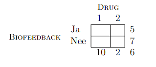

```{r, echo = FALSE, results = "hide"}
include_supplement("vufgb-twowayanova-023-nl-table01.jpg", recursive = TRUE)
```

Question
========

In a study of exertion, the two factors are: Drug Type (1 or 2), and Biofeedback (whether or not). The dependent variable is the increase in blood pressure from a premeasurement. Given is the table below with marginal averages. The same number of people participate in each cell. What is the expected mean for the participants who receive both Drug 1 and Biofeedback receive if only main effects were present?


  
Answerlist
----------
* 9
* 7.5
* 12
* 11

Solution
========

Answerlist
----------
* Correct
* Incorrect
* Incorrect
* Incorrect

Meta-information
================
exname: vufgb-twowayanova-023-en
extype: schoice
exsolution: 1000
exsection: Descriptive statistics/Summary Statistics/Measures of Location/Mean, Descriptive statistics/Data representation/Tables, Inferential Statistics/Parametric Techniques/ANOVA/Twoway ANOVA
exextra[ID]: 42b57
exextra[Type]: Calculation
exextra[Program]: 
exextra[Language]: English
exextra[Level]: Statistical Thinking
