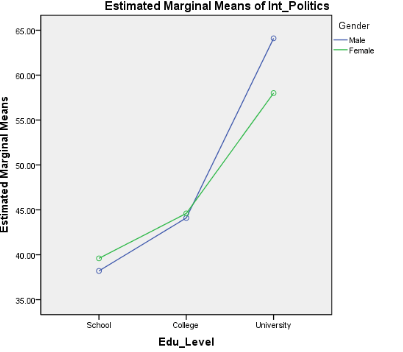

```{r, echo = FALSE, results = "hide"}
include_supplement("vufgb-twowayanova-024-nl-figure01.jpg", recursive = TRUE)
```

Question
========

Given is the plot below with estimated means ('estimated means'). What type of ANOVA analysis was used?


  
Answerlist
----------
* One-way analysis of variance ('One-way ANOVA')
* Two-way analysis of variance ('Two-way ANOVA')
* Three-way analysis of variance ('Three-way ANOVA')
* Covariance analysis (ANCOVA)

Solution
========

Answerlist
----------
* Incorrect
* Correct
* Incorrect
* Incorrect

Meta-information
================
exname: vufgb-twowayanova-024-en
extype: schoice
exsolution: 0100
exsection: Inferential Statistics/Parametric Techniques/ANOVA/Twoway ANOVA
exextra[Type]: Interpreting graph, Conceptual, Test choice
exextra[Program]: SPSS
exextra[Language]: English
exextra[Level]: Statistical Literacy
