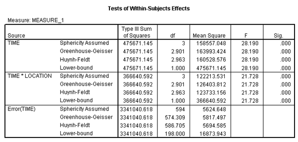

```{r, echo = FALSE, results = "hide"}
include_supplement("vufgb-twowayrepeatedmeasuresanova-001-nl.png", recursive = TRUE)
```

Question
========
A repeated measures ANOVA in SPSS gives the following results.



Which conclusion about these outcomes is correct? Complete: "The rate of change over time on the outcome variable..."

Answerlist
----------
* ...depends on the variable Location.
* ...linear.
* ...is random and varies from person to person.
* ...appears after statistically controlling for the variable Location.

Meta-information
================
exname: vufgb-twowayrepeatedmeasuresanova-001-EN
extype: schoice
exsolution: 1000
exsection:Inferential Statistics/Parametric Techniques/ANOVA/Twoway repeated measures ANOVA
exextra[Type]: Interpreting output
exextra[Language]: Dutch
exextra[Level]: Statistical Thinking
