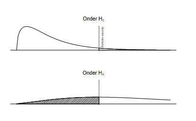

```{r, echo = FALSE, results = "hide"}
include_supplement("vufgb-typeiierror-009-nl-table01.jpg", recursive = TRUE)
```

Question
========

Given is the distribution of the *F* Ratio under both hypotheses. What is the shaded portion called?


  
Answerlist
----------
* Power
* Probability of a type II error
* Chance of a type I error
* Confidence

Solution
========

Answerlist
----------
* Incorrect
* Correct
* Incorrect
* Incorrect

Meta-information
================
exname: vufgb-typeiierror-009-en
extype: schoice
exsolution: 0100
exsection: Inferential Statistics/NHST/Statistical errors/Type II error
exextra[ID]: 0385c
exextra[Type]: Interpreting graph, Conceptual
exextra[Program]: 
exextra[Language]: English
exextra[Level]: Statistical Literacy
