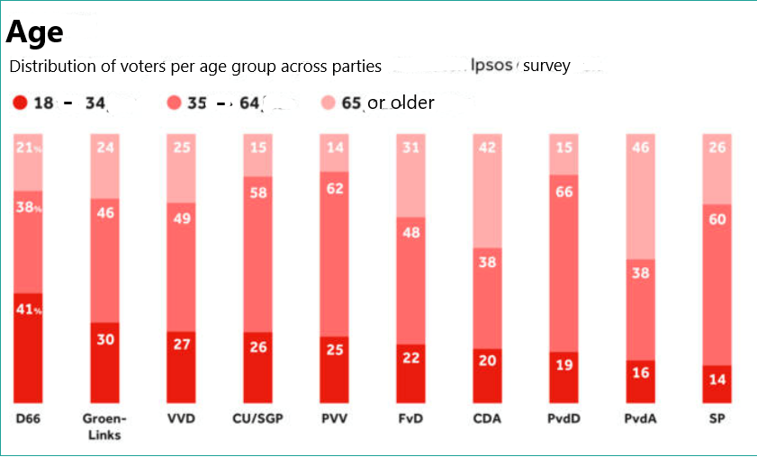

```{r, echo = FALSE, results = "hide"}
include_supplement("tempsnip.png")
```

Question
========
Stel dat bekend is dat 50% van de stemgerechtigden in Nederland tussen de 35 en 64 jaar oud is, terwijl 25% tussen de 18 tot 35 jaar en 25% ouder is dan 65 jaar.  
  
Tijdens de provinciale verkiezingen in Nederland in 2019 heeft de partij
* Orum voor Democratie*(FvD) op de eerste plaats. Een onderzoeker denkt dat het percentage oudere kiezers (65 jaar of ouder) dat FvD steunde groter is dan 25%. groter is dan 25%. Om dit te testen gebruikt ze een steekproef met gegevens verzameld door onderzoeksbureau Ipsos. Eigenlijk zijn de gegevens afkomstig van een online enquête onder 2.848 stemgerechtigden voor de Nederlandse nationale verkiezingen.  
  
Deze gegevens geven de volgende resultaten:  

De onderzoeker gebruikt een significantieniveau van 5% (alfa = 0,05).  
  
Wat is de alternatieve hypothese van deze test?

Answerlist
----------
* H<sub>a</sub>: *p*<sub>0 </sub>≠ 0,25.
* H<sub>a</sub>: *p*<sub>0 </sub>&lt; 0,25.
* H<sub>a</sub>: *p*<sub>0 </sub>= 0,25.
* H<sub>a</sub>: *p*<sub>0 </sub>&gt; 0,25.

Solution
========

Answerlist
----------
* Onwaar
* Onwaar
* Onwaar
* Waar

Meta-information
================
exname: vufsw-alternative hypothesis-1278-nl
extype: schoice
exsolution: 0001
exshuffle: TRUE
exsection: inferential statistics/nhst/hypothesis/alternative hypothesis
exextra[Type]: conceptual
exextra[Program]: NA
exextra[Language]: Dutch
exextra[Level]: statistical literacy

