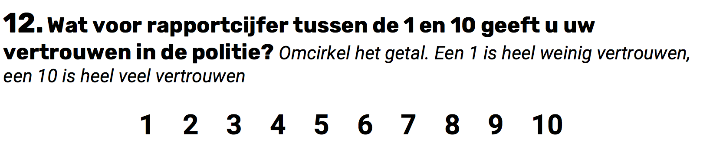

```{r, echo = FALSE, results = "hide"}
include_supplement("Screen__Shot__2020-04-22__at__14.08.43.png", recursive = TRUE)
```

Question
========
A survey included the question below on the extent to which to what extent a person trusts the police. This variable is called "Rating_police".  
  
Respondents also answered questions about their origins. According to the CBS definition, a person has a migration background if this person, or one of the parents, was born in another country. On the basis this, the researcher constructed the dummy variable "Migration background" constructed (1=respondent has a migration background; 0=respondent has no migration background).  
  
She expects people with a migration background to have less trust have in the police than people without a migration background and conducts an Independent t-test to find out whether this is so. We test one-way with α = 0.05 (alpha =5%). What is the correct alternative hypothesis associated with this one-sided test?  
  
  


Answerlist
----------
* Alternative hypothesis: there is *no* difference in the average degree of trust in the police between people with a migration background and people without a migration background.
* Alternative hypothesis: the average degree of trust in the police of people with a migration background is *lower* than the average degree of trust in the police of people without a migration background.
* Alternative hypothesis: the average degree of trust in the police of people without a migration background is *not* different from 0, but the average degree of trust in the police of people with a migration background is *lower* than 0.
* Alternative hypothesis: the average degree of trust in the police of people without a migration background deviates *not* from 5, but the average degree of trust in the police of people with a migration background is *lower* than 5.

Solution
========

Language Dutch

Levels of Difficulty Easy

M&T Basics of quantitative research Basics of quantitative research

M&T BIS Default value
Answerlist
----------
* False
* True
* False
* False

Meta-information
================
exname: vufsw-alternativehypothesis-0075-en
extype: schoice
exsolution: 0100
exshuffle: TRUE
exsection: inferential statistics/nhst/hypothesis/alternative hypothesis
exextra[Type]: conceptual
exextra[Program]: NA
exextra[Language]: English
exextra[Level]: statistical literacy

