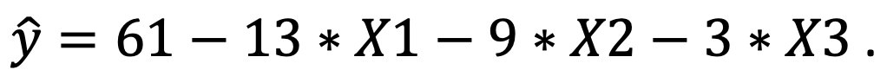

```{r, echo = FALSE, results = "hide"}
include_supplement("Screenshot__2021-03-16__at__15.15.45.png", recursive = TRUE)
```

Question
========
Suppose we conducted a survey and estimated a regression model to examine what factors influence mental health among employees influence. It is predicted that high psychological demands, lack of control over work, and lack of social support at work all reduce mental health.  
  
We measure "mental health" (Y) on a scale of 0-100, where a higher score means better mental health. For the characteristics of the job a person has, we distinguish between "psychological demands" (*X*1), "lack of control" (*X*2) and "lack of of social support" (*X*3). We measure each independent variable on a scale from 0 (low on this characteristic) to 4 (high on this characteristic).  
  
We find the following regression equation (see below) : What is the alternative hypothesis for the effect of psychological demands on one's mental health?  
  


Answerlist
----------
* Ha: β = 0
* Ha: β &gt; 0
* Ha: β &lt; 0
* Ha: β ≠ 0

Solution
========

Answerlist
----------
* False
* False
* True
* False

Meta-information
================
exname: vufsw-alternativehypothesis-0223-en
extype: schoice
exsolution: 0010
exshuffle: TRUE
exsection: inferential statistics/nhst/hypothesis/alternative hypothesis
exextra[Type]: test choise
exextra[Program]: NA
exextra[Language]: English
exextra[Level]: statistical reasoning

