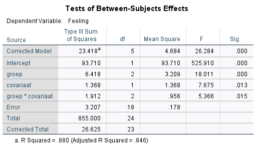

```{r, echo = FALSE, results = "hide"}
include_supplement("1615889347235.png")
```

Question
========
Look at the output below.  
If we want to perform an ANCOVA with "Feeling" as the dependent
variable, "group" as the experimental manipulation and "covariate" as
the covariate, what F value should we use to test the assumption of
Homogeneity of Regression slopes? Use 3 decimal places.  
  



Solution
========


Meta-information
================
exname: vufsw-ancova-0254-en
extype: num
exsolution: 5.366
extol: 0.00499999999999989
exsection: inferential statistics/parametric techniques/anova/ancova
exextra[Type]: conceptual
exextra[Program]: NA
exextra[Language]: Meta-information
================
exname: vufsw-correlation-1294-en
extype: num
exsolution: 0.2
extol: 0
exsection: descriptive statistics/summary statistics/bivariate statistics/correlation
exextra[Type]: calculation
exextra[Program]: calculator
exextra[Language]: english
exextra[Level]: statistical literacy

exextra[Level]: statistical reasoning

