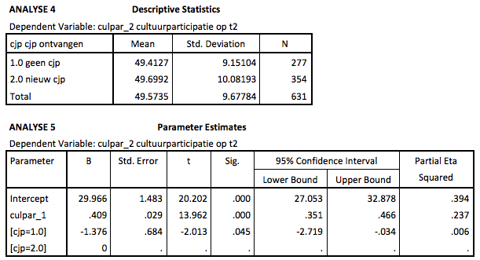

```{r, echo = FALSE, results = "hide"}
include_supplement("Schermafbeelding__2019-01-30__om__19.20.50.png", recursive = TRUE)
include_supplement("Schermafbeelding__2019-01-30__om__19.21.31.png", recursive = TRUE)
```

Question
========
Below are a number of output tables of a series of ANOVA and ANCOVA
analyses of cultural participation, measured at time 1 (culpar\_1:
before the CJP was distributed) and at time 2 (culpar\_2) among the same
respondents who can be divided into two groups: a group that did not
receive a CJP and a group that received a CJP between time 1 and 2 (a
group that already had a CJP was not considered).  
  

  
See analyses 4 and 5. If you take into account the existing differences
in cultural participation between the CJP groups at t1, how big are the
estimated differences between the 'no CJP' group and the 'new CJP'
group?

Answerlist
----------
* .287
* .409
* -1.376
* 29.966

Solution
========


Answerlist
----------
* False
* False
* True
* False

Meta-information
================
exname: vufsw-ancova-2070-en
extype: schoice
exsolution: 0010
exshuffle: TRUE
exsection: inferential statistics/parametric techniques/anova/ancova
exextra[ID]: 48405
exextra[Type]: interpreting output
exextra[Program]: NA
exextra[Language]: English
