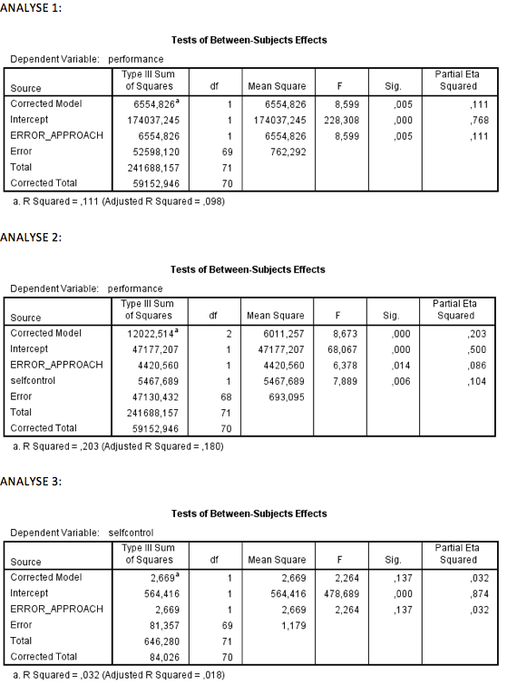

```{r, echo = FALSE, results = "hide"}
include_supplement("Schermafbeelding__2019-01-30__om__19.34.46.png", recursive = TRUE)
include_supplement("Schermafbeelding__2019-01-30__om__19.36.05.png", recursive = TRUE)
```

Question
========
In an experiment, participants were randomly divided into two groups (group variable: ERROR_APPROACH) who had to perform a task. The two groups were instructed differently beforehand: error prevention (" you are not allowed to make mistakes" ) and error management (" you are allowed to make mistakes make mistakes, you learn from them"). Below is a series of AN(C)OVA analyses TRUE examined whether error-approach affects how well the task was performed (PERFORMANCE). SELFCONTROL (degree of self-discipline, measured prior to the experiment) is a covariate in these analyses a covariate.  
  

  
How do you test whether the assumption of the 'homogeneity of regression slopes' of ANCOVA met?

Answerlist
----------
* By adding to analysis 2 the interaction between self-control and error-approach to analysis 2, the *F* value of the interaction effect between the two tests the assumption
* By adding to analysis 2 the interaction between selfcontrol and error-approach to analysis 2; the *F* value of the 'corrected model' tests this assumption
* By taking self-control as the dependent variable and error-approach as the independent variable. as independent; the *F* value of the 'corrected model' tests this assumption
* By taking self-control as dependent variable and error-approach as independent as independent; the *F* value of the interaction effect between the two tests the assumption

Solution
========

Answerlist
----------
* True
* False
* False
* False

Meta-information
================
exname: vufsw-ancova-2074-en
extype: schoice
exsolution: 1000
exshuffle: TRUE
exsection: inferential statistics/parametric techniques/anova/ancova
exextra[ID]: 93f3a
exextra[Type]: interpreting output
exextra[Program]: NA
exextra[Language]: English
exextra[Level]: statistical reasoning

