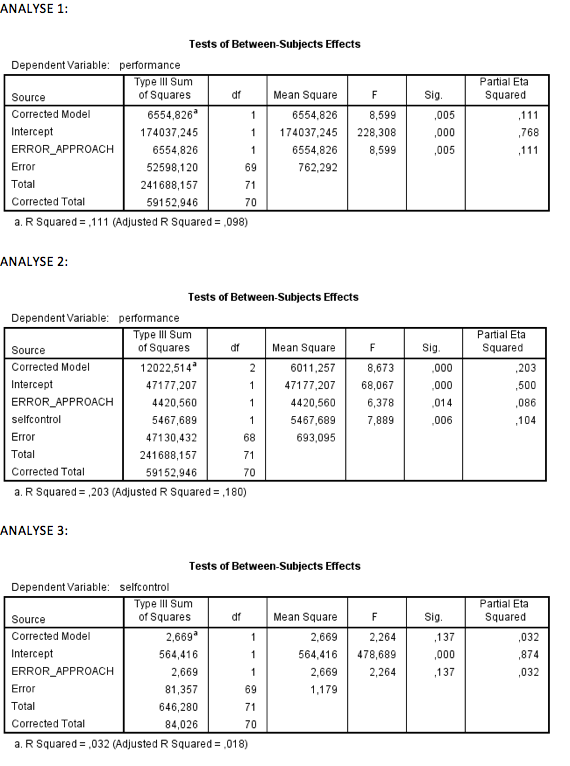

```{r, echo = FALSE, results = "hide"}
include_supplement("Schermafbeelding__2019-01-30__om__19.34.46.png", recursive = TRUE)
include_supplement("Schermafbeelding__2019-01-30__om__19.36.05.png", recursive = TRUE)
```

Question
========
In an experiment, participants were randomly divided into two groups (group variable: ERROR_APPROACH) who had to perform a task. The two groups were instructed differently beforehand: error prevention (" you are not allowed to make mistakes" ) and error management (" you are allowed to make mistakes make mistakes, you learn from them"). Below is a series of AN(C)OVA analyses TRUE examined whether error-approach affects how well the task was performed (PERFORMANCE). SELFCONTROL (degree of self-discipline, measured prior to the experiment) is a covariate in these analyses a covariate.  
  

  
Which statement is true for the population?  
1: There is insufficient evidence that participants in the 'error management' group, prior to the experiment differ in self-discipline from those in the 'error prevention' group 2: Taking into account existing differences in self-discipline, the 'error management' instruction leads to higher performance on the task than the 'error prevention' instruction

Answerlist
----------
* Only statement 1 is correct
* Only statement 2 is correct
* Both statement 1 and 2 are correct
* Neither statement is correct

Solution
========

Answerlist
----------
* False
* False
* True
* False

Meta-information
================
exname: vufsw-ancova-2077-en
extype: schoice
exsolution: 0010
exshuffle: TRUE
exsection: inferential statistics/parametric techniques/anova/ancova
exextra[Type]: interpreting output
exextra[Program]: NA
exextra[Language]: English
exextra[Level]: statistical literacy

