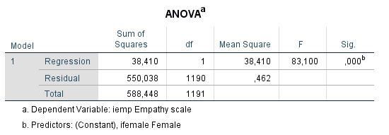

```{r, echo = FALSE, results = "hide"}
include_supplement("anova__table.jpg", recursive = TRUE)
```

Question
========
Een psycholoog voert een regressie uit met empathie als afhankelijke variabele (Y) en geslacht als onafhankelijke variabele (X). Ze vindt een F-statistiek van 83,1, met p &lt; 0,001 (zie de ANOVA tabel hieronder). Wat betekent dit?  
  
  


Antwoordlijst
----------
* Het verband tussen geslacht en empathie is positief en statistisch significant.
* Het regressiemodel met geslacht doet het significant beter in het verklaren van de variantie in empathie dan een model zonder verklarende variabelen.
* Het gemiddelde van empathie verschilt significant van het gemiddelde van geslacht.
* De regressiesom van de kwadraten is positief en statistisch significant.

Solution
========

De F-statistiek is een maat voor de voorspellende kracht en hangt af van het gemiddelde kwadraat voor regressie en de gemiddelde kwadraatfout. De F-statistiek is significant als het model de variantie van de afhankelijke variabele beter verklaart dan een model zonder verklarende variabelen. afhankelijke variabele dan een model zonder verklarende variabelen.

Antwoordlijst
----------
* Onjuist
* Waar
* Onwaar
* Onwaar

Meta-information
================
exname: vufsw-anova f-test-1100-nl
extype: schoice
exsolution: 0100
exshuffle: TRUE
exsection: inferential statistics/parametric techniques/anova/anova f-test
exextra[Type]: conceptual
exextra[Program]: NA
exextra[Language]: Dutch
exextra[Level]: statistical reasoning

