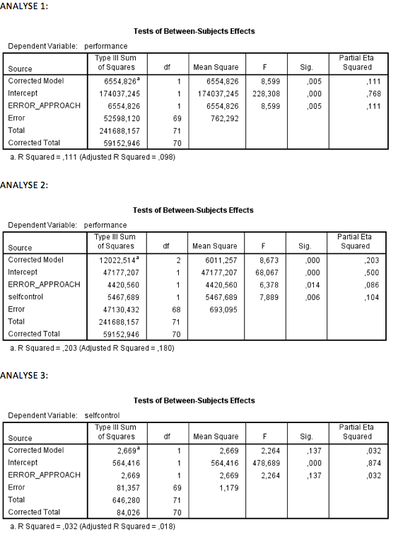

```{r, echo = FALSE, results = "hide"}
include_supplement("Schermafbeelding__2019-01-30__om__19.34.46.png")
include_supplement("Schermafbeelding__2019-01-30__om__19.36.05.png")
```

Question
========
In een experiment werden deelnemers random verdeeld over twee groepen
(groepsvariabele: ERROR\_APPROACH) die een taak moesten uitvoeren. De
beide groepen werden vooraf verschillend geïnstrueerd: error prevention
 (“ je mag geen fouten maken” ) en error management (“ je mag fouten
maken, je leert ervan”). Hieronder staat een serie AN(C)OVA analyses
waarin onderzocht is of de ‘error-approach’ van invloed is op hoe goed
de taak is uitgevoerd (PERFORMANCE). SELFCONTROL (mate van
zelfdiscipline, gemeten voorafgaand aan het experiment) is in deze
analyses een covariaat.  
  

  
Welke *F*-waarde toetst of aan de assumptie van de onafhankelijkheid van
covariaat en treatment voldaan is?

Answerlist
----------
* 2.264
* 7.889
* 8.599
* 8.673

Solution
========


Answerlist
----------
* True
* False
* False
* False

Meta-information
================
exname: vufsw-anova f-test-2073-nl
extype: schoice
exsolution: 1000
exshuffle: TRUE
exsection: inferential statistics/parametric techniques/anova/anova f-test
exextra[Type]: interpreting output
exextra[Program]: NA
exextra[Language]: Dutch
exextra[Level]: statistical literacy

