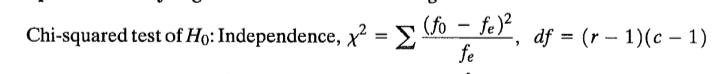

```{r, echo = FALSE, results = "hide"}
include_supplement("1547820971946.png", recursive = TRUE)
```

Question
========
In de onderstaande tabel staan gegevens van een enquête in een museum.  
  

<tabel> <colgroep> <col style="width: 20%" /> <col style="width: 20%" /> <col style="width: 20%" /> <col style="width: 20%" /> <col style="width: 20%" /> </colgroep> <tbody> <tr class="odd"> <td><br /> </td> <td class="tvcss_2">Managersfunctie<br /> </td> <td class="tvcss_3">Ondersteunende functie<br /> </td> <td class="tvcss_4">Aangenomen als freelancer<br /> </td> <td class="tvcss_5">Totaal</td> </tr> <tr class="even"> <td>Mannen</td> <td class="tvcss_2">12</td> <td class="tvcss_3">20</td> <td class="tvcss_4">11</td> <td class="tvcss_5">43</td> </tr> <tr class="odd"> <td>vrouwen</td> <td class="tvcss_2">8</td> <td class="tvcss_3">26</td> <td class="tvcss_4">9</td> <td class="tvcss_5">43</td> </tr> <tr class="even"> <td>Totaal</td> <td class="tvcss_2">20</td> <td class="tvcss_3">46</td> <td class="tvcss_4">20</td> <td class="tvcss_5">86</td> </tr> </tbody> </table>

  
Zijn geslacht en type baan bij dit museum onafhankelijk van elkaar? Test met alfa = .05.

Answerlist
----------
* Ja, want de geobserveerde chi-kwadraat is groter dan de kritische chi-kwadraat. chi-kwadraat.
* Ja, want de waargenomen chi-kwadraat is kleiner dan de kritische chi-kwadraat. .

Solution
========

De kritische waarde kan worden gevonden in de tabel. De waargenomen waarde kan berekend worden met:  
  

f<sub>0</sub> is het geobserveerde aantal en f<sub>e </sub> is het verwachte getal. r = rij en c = kolom.

Answerlist
----------
* Onwaar
* Waar

Meta-information
================
exname: vufsw-chi-squared for independence-1262-nl
extype: schoice
exsolution: 01
exshuffle: TRUE
exsection: inferential statistics/parametric techniques/cross tables/chi-squared for independence
exextra[ID]: 38bea
exextra[Type]: performing analysis
exextra[Program]: calculator
exextra[Language]: Dutch
exextra[Level]: statistical thinking

