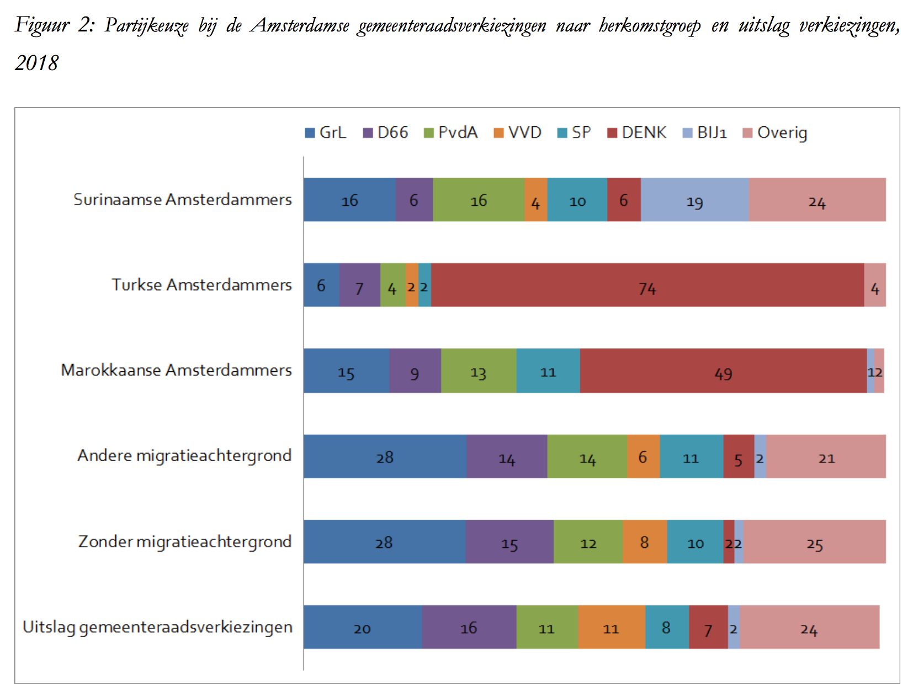

```{r, echo = FALSE, results = "hide"}
include_supplement("Screen__Shot__2020-05-01__at__02.20.06.png", recursive = TRUE)
```

Question
========
The figure at the bottom of the question is from a research report by Kranendonk et al. (2018) and shows the relationship between voting preference in Amsterdam municipal elections (in percentages) and origin. The study is based on 3,322 surveys conducted at 18 polling stations.    
  
Suppose as a researcher you want to examine the extent to which a significant relationship between these two variables, origin (X) and voting preference (Y). Do you then choose to conduct a simple regression analysis or to conduct a Chi-squared test (*Chi-squared test*)? Why? 
* Sub>Source:Kranendonk,M.,Lekkerkerker,E.,Michon,L.,& Vermeulen,F. (2018).Voter turnout and voting behavior of Amsterdam residents of immigrant backgrounds in municipal elections of March 21, 2018.</sub   

  
<sub> </sub>

Answerlist
----------
* A Chi-square test, because the variable voting preference is a categorical variable with multiple categories without ranking.
* A single regression analysis, because it not only allows you to test the test statistical significance of the relationship, but also check the practical significance check.
* A Chi-square test, because in this case we need to test the *confounding* ('confounding') variables precisely do need to hold constant.
* A single regression analysis, because the sample consists of more than 100 respondents.

Solution
========

Answerlist
----------
* True
* False
* False
* False

Meta-information
================
exname: vufsw-chisquared-0005-en
extype: schoice
exsolution: 1000
exshuffle: TRUE
exsection: inferential statistics/nhst/test statistic/chi-squared
exextra[Type]: test choice
exextra[Program]: NA
exextra[Language]: English
exextra[Level]: statistical thinking

