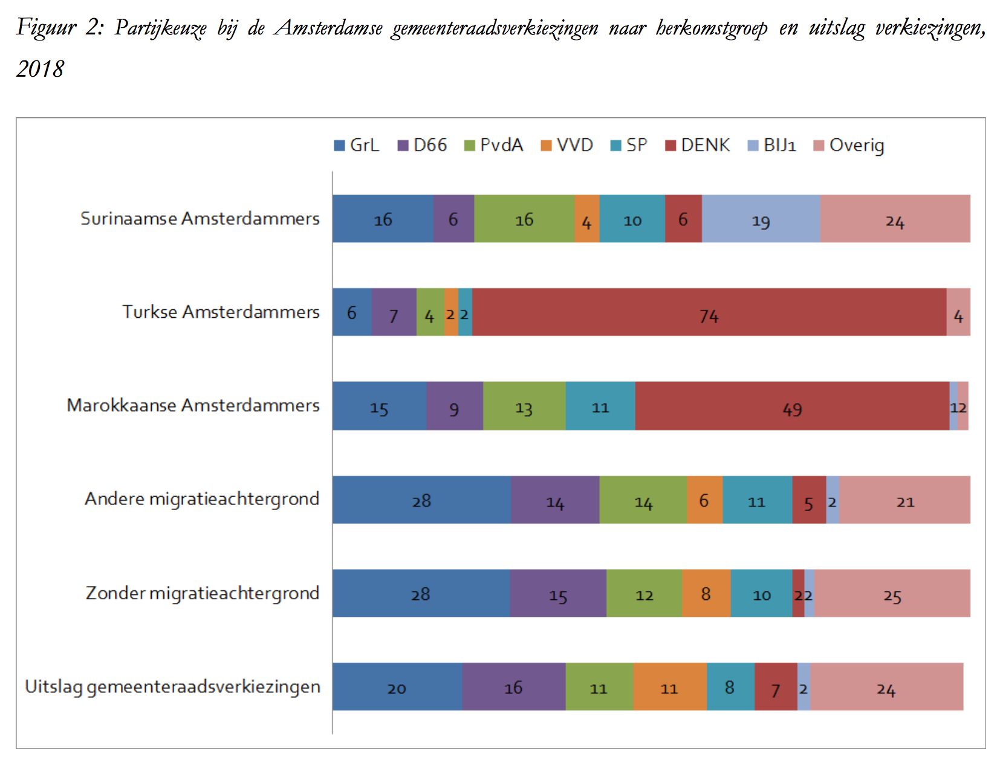

```{r, echo = FALSE, results = "hide"}
include_supplement("Screen__Shot__2020-05-01__at__02.20.06.png")
```

Question
========
De figuur onderaan de vraag is afkomstig uit een onderzoeksrapport van
Kranendonk et al. (2018) en laat het verband zien tussen stemvoorkeur
bij de Amsterdamse gemeenteraadsverkiezingen (in percentages) en
herkomst. De studie is gebaseerd op 3.322 enquêtes die zijn afgenomen
bij 18 stembureaus.    
  
Stel dat je als onderzoeker wilt nagaan in hoeverre er een significant
verband bestaat tussen deze beide variabelen, herkomst (X) en
stemvoorkeur (Y). Kies je dan voor het uitvoeren van een enkelvoudige
regressie-analyse of voor het uitvoeren van een Chi-kwadraattoets
(*Chi-squared test*)? Waarom?   
  
*<sub>Bron:\ Kranendonk,\ M.,\ Lekkerkerker,\ E.,\ Michon,\ L.\ &\ Vermeulen,\ F.\ (2018).\ Opkomst\ en\ stemgedrag\ van\ Amsterdammers\ met\ een\ migratieachtergrond\ tijdens\ de\ gemeenteraadsverkiezingen\ van\ 21\ maart\ 2018.</sub>*   
  
  
<sub>  
</sub>

Answerlist
----------
* Een Chi-kwadraattoets, want de variabele stemvoorkeur is een
  categorische variabele met meerdere categorieën zonder rangordening.
* Een enkelvoudige regressie-analyse, want je kunt hiermee niet alleen de
  statistische significantie van het verband toetsen, maar ook de
  praktische significantie nagaan.
* Een Chi-kwadraattoets, want we moeten in dit geval de *confounding*
  ('verstorende') variabelen juist wel constant houden.
* Een enkelvoudige regressie-analyse, want de steekproef bestaat uit meer
  dan 100 respondenten.

Solution
========


Answerlist
----------
* True
* False
* False
* False

Meta-information
================
exname: vufsw-chisquared-0005-nl
extype: schoice
exsolution: 1000
exshuffle: TRUE
exsection: inferential statistics/nhst/test statistic/chi-squared
exextra[Type]: test choice
exextra[Program]: NA
exextra[Language]: Dutch
exextra[Level]: statistical thinking

